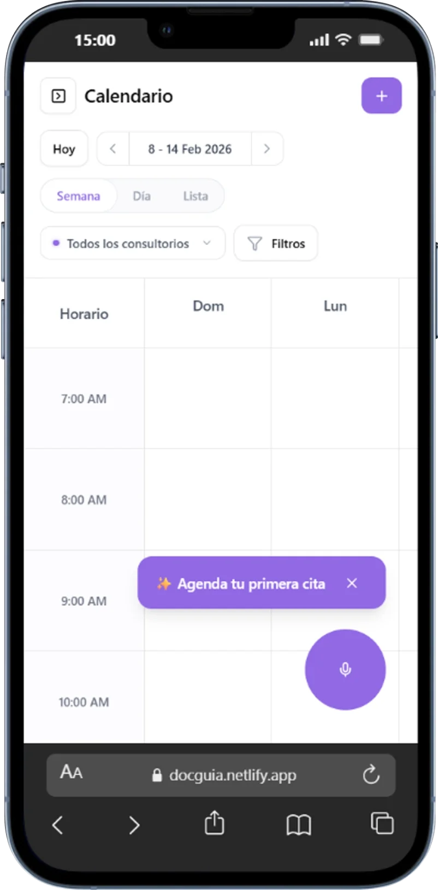
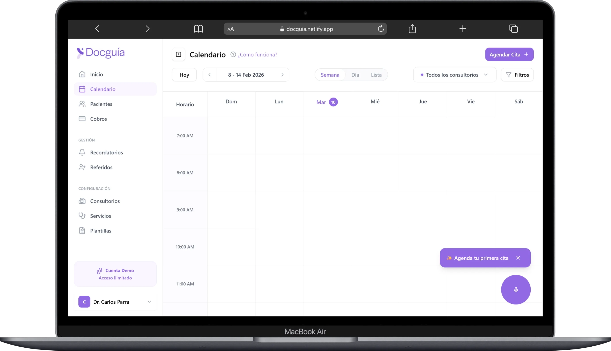

# DOCGUIA Interview Test

Este repositorio contiene la resolución de una prueba técnica para DocGuía, cuyo objetivo es emular una interfaz de calendario para especialistas de salud e implementar una experiencia de gestión de agenda mediante comandos de voz (**Voice-First**). El proyecto demuestra habilidades en emulación de UI, procesamiento de lenguaje natural ligero (Regex-based), gestión de estados complejos en React y arquitectura de software modular.

---

## 🚀 Demo

[Ver el proyecto en vivo (Netlify)](https://docguia.netlify.app/)

## Capturas de Pantalla




## 🎤 Experiencia de Voz (Challenge Core)

El sistema transforma el habla natural en citas estructuradas, manejando el contexto médico de forma inteligente.

### Dataset de Ejemplos

Puedes probar la experiencia de voz haciendo clic en el micrófono y dictando (o usando la rotación de mock data):

- **Creación**: "Cita para María Pérez mañana a las 3 por control"
- **Edición**: "Mueve la cita de las 8 a las 9"
- **Bloqueos**: "Bloquéame la agenda el lunes a las 11 am para una reunión"
- **Detección de Ambigüedad**: "Agéndame a Juan a las 7" (Detona selección AM/PM)

### Estrategia de UX y Ambigüedades

Para este challenge, se definió una estrategia de **Acompañamiento Inteligente**:

1.  **Contexto Médico (Smart Defaults)**:
    - Las horas **1-6** sin periodo se asumen automáticamente como **PM** (las citas a las 3 AM son nulas en consulta externa).
    - Las horas **7-12** sin periodo se marcan como **Ambiguas**, forzando al especialista a elegir mediante botones de acción rápida para evitar errores críticos.
2.  **Confirmación y Validación**: Se implementó una decisión de UX crítica: **no guardar ni editar sin confirmación previa**. Esto permite al usuario validar los datos extraídos por el motor de voz y añadir manualmente información que faltase (como una nota específica) antes del commit final, asegurando total control sobre la agenda.
3.  **Progressive Disclosure**: Si faltan campos (paciente, motivo), el sistema crea un "borrador" y pregunta específicamente por el dato faltante en lugar de rechazar el comando.
4.  **Soporte Local**: Soporte nativo para expresiones como "y cuarto", "y media", "pasado mañana" y días de la semana en español.

---

## 🛠️ Decisiones Técnicas

- **Estandarización ISO**: Todas las fechas se normalizan a `YYYY-MM-DD` en el punto de entrada para garantizar consistencia en el calendario.
- **Approach Híbrido (NLP)**: Actualmente el sistema utiliza un motor de reglas basado en Regex para respuesta inmediata (0ms de latencia). Sin embargo, se propone una arquitectura híbrida donde reglas deterministas manejen lo estructurado y un LLM (ej. Gemini Flash 2.0) resuelva ambigüedades semánticas profundas, mejorando la mantenibilidad.
- **Búsqueda Robusta por Nombre**: Para la edición de citas, el sistema implementa una normalización de strings (accent-insensitive) que permite encontrar pacientes ignorando tildes y mayúsculas.
- **Gestión de Colisiones**: Se implementó una UI limpia donde, tras crear o mover una cita, el sistema detecta visualmente el solapamiento. El usuario puede resolver el conflicto de forma rápida y visual.
- **Separación de Concerns**: La lógica de parsing está totalmente desacoplada de la UI, permitiendo su testeo unitario exhaustivo.

---

## 📁 Estructura del Proyecto

Se ha optado por una arquitectura modular que separa estrictamente la UI de la lógica de negocio, facilitando el mantenimiento y la escalabilidad del sistema.

```text
├── app/                      # Next.js App Router (Layouts & Pages)
│   ├── globals.css           # Estilos globales y tokens de Tailwind 4
│   └── page.tsx              # Punto de entrada del calendario
├── components/               # Componentes React Atómicos y Organismos
│   ├── calendar/             # Organismos del Calendario (Grid, Header)
│   │   └── calendarStructure/# Componentes internos de la cuadrícula
│   ├── voice/                # Módulo de Voz (VoiceAssistant, Transcripción)
│   │   └── voiceStructure/   # Micro-componentes del asistente de voz
│   ├── appointments/         # Formularios y Drawers de citas
│   │   └── appointmentForm/  # Lógica de formulario reactivo
│   └── ui/                   # Base de Diseño (Shadcn/UI - Buttons, Dialogs, etc.)
├── constants/                # Single Source of Truth para datos estáticos
│   ├── appointments.ts       # Mock datasets y configuraciones iniciales
│   └── calendar.ts           # Configuración de rangos horarios y días
├── hooks/                    # Lógica de Estado y Custom Hooks
│   ├── use-appointments.ts   # Orquestador del estado de las citas
│   └── use-calendar.ts       # Utilidades de navegación temporal
├── lib/                      # Core Logic (Separado de la UI)
│   ├── appointment-parsing.ts# El Motor de Voz (Independiente de React)
│   └── appointment-utils.ts  # Mapeadores, calculadores de colisión e ISO
├── types/                    # Tipado fuerte de TypeScript (Interfaces & Types)
└── lib/*.spec.ts             # Suite de Verificación (Tests Unitarios)
```

### ¿Por qué esta estructura?

- **Separación de Concerns**: La lógica de parsing (`lib/`) no sabe nada de React. Esto permite que el motor de voz sea testeable y portable.
- **Atomicidad en Components**: Los directorios `*Structure` permiten mantener los archivos principales limpios, delegando los sub-componentes visuales a carpetas dedicadas.
- **Hooks como Orquestadores**: Toda la lógica de actualización del calendario reside en hooks, dejando a los componentes como puras representaciones visuales del estado.

---

## 🌟 Bonus Implementados

1.  **Edición por Voz**: Capacidad de mover citas existentes mediante comandos como "reprograma la cita de las 8 para las 9".
2.  **Gestión de Conflictos**: Algoritmo de visualización de solapamientos que ajusta dinámicamente el ancho de las citas en conflicto.
3.  **Soporte Local Extendido**: Manejo de cronogramas en español y formatos relativos avanzados.

---

## 📋 Limitaciones y Roadmap

### Funcionalidades Actuales (MVP)

- **Movimiento por Día**: Se pueden mover citas existentes a otros días ("mañana", "viernes", "20 de febrero") buscando al paciente por nombre en la agenda del día actual.
- **Detección de Ambigüedades**: Manejo inteligente de periodos AM/PM para evitar errores de agendado.

### Limitaciones Identificadas

- **Edición de Hora en Movimiento**: Al mover una cita de día, se mantiene la hora original por simplicidad del motor de reglas. La edición simultánea de día y hora se beneficiaría de un modelo LLM.
- **Cancelaciones y Recurrencia**: El motor actual no procesa cancelaciones ni citas recurrentes.
- **Mantenibilidad de Reglas**: El enfoque basado puramente en Regex tiene un límite de escalabilidad.

### Futuras Mejoras (Roadmap)

1.  **Híbrido con LLM**: Migrar el core de `appointment-parsing.ts` a un prompt estructurado para Gemini Flash 2.0 para identificar datos complejos como el centro médico o razones de consulta no parametrizadas.
2.  **Notas de Edición Automáticas**: Al editar una cita por voz ("muévela..."), se podría usar un modelo para capturar la justificación del cambio del audio ("porque el paciente tiene una urgencia") y adjuntarla como nota, brindando trazabilidad y tranquilidad al paciente.
3.  **Confirmación Proactiva de Disponibilidad**: Sugerir horarios alternativos cuando el comando del usuario colisiona con una cita existente o bloqueada.
4.  **Consciencia de Horario Laboral**: Integrar el parser con los horarios específicos del doctor para evitar agendados fuera de jornada o en días no laborables.

---

## 🚀 Instalación y Ejecución

Sigue estos pasos para ejecutar el proyecto en tu entorno local:

### 1. Clonar el repositorio

```bash
git clone https://github.com/Vctorqui/docguia-interview-test.git
cd docguia-interview-test
```

### 2. Instalar dependencias

Este proyecto utiliza `pnpm` para una gestión eficiente de paquetes:

```bash
pnpm install
```

### 3. Ejecutar el servidor de desarrollo

```bash
pnpm run dev
```

Abre [http://localhost:3000](http://localhost:3000) en tu navegador para ver el resultado.
